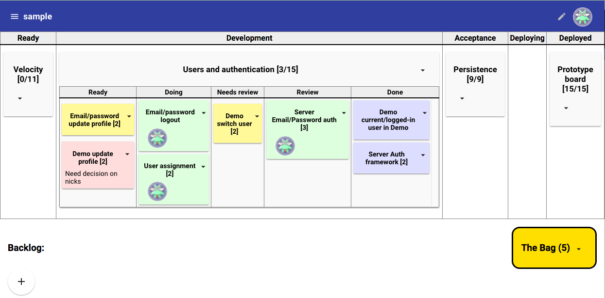

==========
Valuenator
==========

Valuenator is a somewhat opinionated implementation of :doc:`feature
flow <index>`
that seeks to automate what's core and proscribing a little else as
practical.

Some important guiding principals:

The core ideas should be automated
  The hierarchicalk relationship between features and tasks is
  explicit.  Task boards are hierarchically displayed within the
  feature board when features enter a developmet state.

A teams activity should be readily visible
  It should be possible to see important information on what and who
  on a computer monitor without scrolling.

  The goal of this is to support standups where people don't talk
  about whet they're working on, because it should be apparent on the
  board.

  Instead, the standup is a chance for address issues, like blocked
  work or pile-ups in the process, which should also be apparent on
  the board.

Teams should be self organizing
  Tasks aren't assigned up front by default.

  Rather as users pull tasks into working states, like doing or
  review, they're automatically self assigned.

Running Valuenator
==================

The easiest way to try Valuenator is with the `demo version
<http://valuenator.com/try-demo>_`.  This let you try out the
application and get familiar with concepts very quickly without making
any commitments or signing up for anything.

We're working on an on-line web-based version of Valuenator.  We'll be
launching an on-line beta soon, and you can `sign up to participate in
the beta now <http://valuenator.com/beta-signup>`_.

Valuenator is an `open-source project
<https://github.com/feature-flow/twotieredkanban>`_, which you can run
yourself, however, making this easy to do isn't a priority at this
time.  It's not very hard, but we're not putting effort into making it
easy at this time. Also, the software is evolving rapidly.

Using Valuenator
================

Using Valuenator amounts to creating and editing features and tasks
and moving them through states by dragging cards on boards.

Let's walk through the user interface, as shown in the screen shot
below:

Top bar
-------

At the top of the window is a bar that shows a menu icon on the left.
Clicking on this icon opens the navigation drawer, which lets you
navigate between drawers.

To the right of the menu ocon is the title of the current board.  On
the roght of the bar is the avatar of the current user. Clicking on
the avatar dispplays a menu of user options, like logging out or
updating profile information.

The avatar comes from `Gravatar <https://en.gravatar.com/>`. Anyone
can use Gravatar to associate an avatar image with their email.  If a
user's email hasn't been registered with Gravatar, a random silly
image is used.  The demo version of Valuenator has sample users with
``example.com`` email addresses so their avatars use silly images. If
you click on the avatar and select "Profile" from the menu, you can
change the email address to use an address registered with Gravatar,
and get a real user image.

Feature and task boards
-----------------------

Below the top bar is the feature board.  Each column in the board
represents a feature state.  The states are editable
[#states_editable_eventually]_. Each feature is shown as a card on the
board.  You can drag a card with your mouse to move it to a new
state.

When a feature is in the development state, it's card contains a task
board, showing the tasks needed to implement the feature.  Tasks are
shown as cards on the task board and can be dragged betweem columns to
change their state.

.. [#states_editable_eventually] Well, they'll be editable eventually.
   This is a planned but so far unimplemented feature.  If this is
   important to you, send an email to feedback@valuenator.com.

